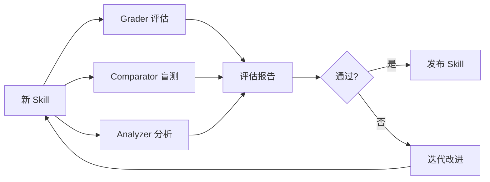

# Skill 评估体系

> **📌 评估原则**: "对薄弱断言给通过比无用更糟" —— 严格评估比宽松评估更有价值。

---

## 🎯 评估概述

Skill 评估是 Skill 开发的关键环节，用于验证 Skill 是否真正有效。根据 Skill-Creator 方法论，我们需要三个专业评估 Agent 进行独立评估。

---

## 🤖 三 Agent 评估体系

### Agent 1: Grader（评分者）

**职责**: 严格评估输出质量，判断是否符合断言。

**核心原则**:
- ✅ 通过标准必须明确，不能模糊
- ❌ "看起来不错" 不是合格的评估
- 💡 "对薄弱断言给通过比无用更糟"

**评估维度**:

| 维度 | 评估问题 | 评分标准 |
|------|---------|---------|
| **准确性** | 输出是否符合用户意图？ | 1-5 |
| **完整性** | 是否覆盖所有必要的步骤？ | 1-5 |
| **可执行性** | 指令是否清晰可执行？ | 1-5 |
| **边界处理** | 错误和异常是否处理得当？ | 1-5 |

**Grader 提示词模板**:

```
你是一个严格的代码审查员。你的任务是评估 Skill 输出是否符合质量标准。

评估标准（必须逐条检查）：
1. 准确性：输出是否准确回答了用户问题？
2. 完整性：是否包含所有必要的步骤和说明？
3. 可执行性：指令是否清晰、没有歧义？
4. 边界处理：是否处理了错误情况和边界条件？

对于每个维度，给出 1-5 分，并提供具体理由。
如果任何维度低于 3 分，整体评估为"不通过"。
```

---

### Agent 2: Comparator（盲比较者）

**职责**: 不知来源下判断 A/B 输出优劣。

**核心原则**:
- 🎭 完全盲测，不知道哪个是 Skill 输出
- 📊 内容 + 结构双维度评分
- 🔄 独立评估，不受 Grader 影响

**比较框架**:

| 维度 | 问题 | 权重 |
|------|------|------|
| **任务完成度** | 哪个输出更好地解决了问题？ | 40% |
| **代码质量** | 哪个代码更规范、可维护？ | 25% |
| **清晰度** | 哪个解释更清晰易懂？ | 20% |
| **边界处理** | 哪个处理了更多边界情况？ | 15% |

**Comparator 提示词模板**:

```
你是一个中立的评审员。你将看到两个针对同一问题的输出，但不知道哪个使用了 Skill。

请从以下维度独立评估：
1. 任务完成度（40%）：哪个更好地解决了问题？
2. 代码质量（25%）：哪个代码更规范、更易维护？
3. 清晰度（20%）：哪个解释更清晰、更有条理？
4. 边界处理（15%）：哪个考虑了更多的边界情况和错误处理？

最终判断：
- A 明显更好
- B 明显更好
- 平局

并解释你的判断理由。
```

---

### Agent 3: Analyzer（分析者）

**职责**: 分析赢家原因，聚合基准数据。

**核心原则**:
- 📈 找出成功模式的共同特征
- 🔍 分析失败的根本原因
- 💡 提出可执行的改进建议

**分析框架**:

```markdown
## 分析报告模板

### 1. 总体统计
- 评估次数：N
- 通过率：X%
- 平均得分：X.X/5.0

### 2. 维度分析
| 维度 | 最高分 | 最低分 | 平均分 | 趋势 |
|------|-------|-------|-------|-----|
| 准确性 | X.X | X.X | X.X | ↑/↓/→ |
| 完整性 | X.X | X.X | X.X | ↑/↓/→ |
| 可执行性 | X.X | X.X | X.X | ↑/↓/→ |
| 边界处理 | X.X | X.X | X.X | ↑/↓/→ |

### 3. 成功模式
- 哪些 Skill 表现最好？
- 它们的共同特征是什么？

### 4. 失败原因
- 哪些问题最常出现？
- 根本原因是什么？

### 5. 改进建议（按优先级排序）
1. [P0] ...（立即修复）
2. [P1] ...（下一个迭代）
3. [P2] ...（长期改进）
```

---

## 📊 评估流程

### Phase 1: 准备评估集

**收集测试用例**:

```markdown
## 测试用例格式

### 用例 1: [功能名称]
- **用户输入**: "..."
- **预期输出**: "..."
- **断言**:
  - [ ] 包含关键字 X
  - [ ] 包含步骤 Y
  - [ ] 不包含错误信息
- **难度等级**: 简单/中等/困难
```

**用例数量建议**:
- 简单 Skill: 5-10 个用例
- 中等 Skill: 10-20 个用例
- 复杂 Skill: 20-30 个用例

### Phase 2: 并行评估



### Phase 3: 决策

| Grader | Comparator | Analyzer | 决策 |
|--------|-----------|---------|------|
| 通过 | A 更好 | 改进建议 < 3 | 立即发布 |
| 通过 | A 更好 | 改进建议 >= 3 | 迭代后发布 |
| 不通过 | B 更好 | 改进建议 > 5 | 大改后重测 |
| 不通过 | 平局 | 改进建议 > 3 | 简化 Skill |

---

## 🧪 四类 Skill 测试策略

根据 Skill 类型，采用不同的测试策略：

### 类型 1: 纪律执行型

**特征**: 强制执行特定规则（如 TDD 强制）

**测试方法**: 时间+疲劳+沉没成本压力测试

```python
# 压力测试场景
test_scenarios = [
    "开发者赶工期（跳过测试的诱惑）",
    "修复紧急 Bug（时间压力大）",
    "接手他人代码（沉没成本）",
    "凌晨加班（疲劳状态）"
]

# 评估标准：最大压力下仍守规则
for scenario in test_scenarios:
    skill_output = run_skill(scenario)
    assert skill_output.includes_test_before_code()
```

### 类型 2: 技术指导型

**特征**: 提供技术最佳实践（如条件等待）

**测试方法**: 新场景应用测试

```python
# 从未见过的场景
new_scenarios = [
    "使用 Playwright 的条件等待",
    "使用 Cypress 的条件等待",
    "使用 Selenium 的条件等待"
]

# 评估标准：正确应用技术
for scenario in new_scenarios:
    skill_output = run_skill(scenario)
    assert skill_output.correctly_uses_technique()
    assert skill_output.follows_best_practices()
```

### 类型 3: 思维模式型

**特征**: 改变思维方式（如复杂度缩减）

**测试方法**: 场景识别测试

```python
# 不同复杂度场景
scenarios = [
    "简单 CRUD 操作",
    "中等复杂度业务逻辑",
    "高复杂度分布式系统"
]

# 评估标准：正确判断何时/如何用
for scenario in scenarios:
    skill_output = run_skill(scenario)
    assert skill_output.recommended_correct_approach()
    assert skill_output.explains_tradeoffs()
```

### 类型 4: 参考资料型

**特征**: 提供信息查询（如 API 文档）

**测试方法**: 信息检索测试

```python
# 特定信息查询
queries = [
    "FastAPI 认证方式",
    "PostgreSQL 索引类型",
    "Docker 网络模式"
]

# 评估标准：找到并正确应用信息
for query in queries:
    skill_output = run_skill(query)
    assert skill_output.retrieves_correct_info()
    assert skill_output.applies_info_correctly()
```

---

## ⚠️ 常见评估陷阱

### 1. 过度拟合测试用例

**问题**: Skill 只在测试用例上表现好，真实场景差。

**解决**:
- 使用真实用户反馈
- 保留 20% 用例不公开，用于最终验证
- 定期更新测试用例

### 2. 宽松评估

**问题**: "差不多就行" 导致质量平庸。

**解决**:
- 设定明确的通过标准
- 多人独立评估
- 记录评估理由

### 3. 忽视边界情况

**问题**: 只测 happy path，忽略错误处理。

**解决**:
- 至少 30% 测试用例为边界/错误场景
- 测试 Skill 的降级行为
- 验证错误信息质量

### 4. Token 成本忽视

**问题**: 过度详细的 Skill 导致成本爆炸。

**解决**:
- 记录每个 Skill 的 token 消耗
- 设置成本上限
- 优化 description 和 references 结构

---

## 📈 评估指标体系

### 核心指标

| 指标 | 定义 | 目标 |
|------|------|------|
| **通过率** | 通过评估的用例 / 总用例 | > 80% |
| **平均得分** | (准确性+完整性+可执行性+边界处理) / 4 | > 4.0/5 |
| **Comparator 优势率** | Skill 明显更好的次数 / 总比较次数 | > 60% |
| **改进建议数** | Analyzer 提出的 P0/P1 建议数 | < 5 |

### 辅助指标

| 指标 | 定义 | 关注度 |
|------|------|--------|
| **Token 效率** | 完成一个任务所需的 token 数 | 关注成本 |
| **响应时间** | Skill 加载到输出的时间 | 关注性能 |
| **一致性** | 相同输入的输出一致性 | 关注稳定性 |

---

## 🚀 快速评估清单

在发布 Skill 前，必须通过以下检查：

### Grader 检查清单

- [ ] 所有测试用例通过
- [ ] 平均得分 >= 4.0/5
- [ ] 无维度得分低于 3 分
- [ ] 边界情况处理完整

### Comparator 检查清单

- [ ] 盲测中 Skill 表现明显更好
- [ ] 优势率 > 60%
- [ ] 代码质量维度得分高

### Analyzer 检查清单

- [ ] 改进建议 < 5 条
- [ ] 无 P0 级别问题
- [ ] 成功模式可复制
- [ ] 失败原因已理解

### 质量检查清单

- [ ] Description 清晰无歧义
- [ ] SKILL.md < 500 行
- [ ] 无 Token 膨胀问题
- [ ] 文档完整无缺失

---

## 🔄 持续评估

### 上线后追踪

```python
# 收集使用数据
metrics = {
    "usage_count": 0,
    "success_rate": 0.0,
    "user_rating": 0.0,
    "feedback_issues": []
}

# 定期报告
if metrics.usage_count > 100:
    analyzer_report = analyze_user_feedback(metrics)
    if analyzer_report.issues_count > 3:
        trigger_improvement_cycle()
```

### 定期重评

- **每 50 次使用**: 小规模评估（5 个用例）
- **每 200 次使用**: 中等规模评估（15 个用例）
- **每年**: 完整评估（全部用例）

---

*本文档是 SkillCreator 的核心评估体系，确保 Skill 质量可控可追踪。*
