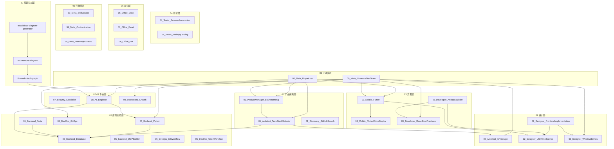

# Skill 依赖图谱

本文档描述了各 Skill 之间的调用关系和依赖关系，帮助理解 Skill 体系的协作机制。

> **📌 自动生成**: 此文档由 `scripts/generate_dependencies.py` 自动生成，基于每个 Skill 的 `metadata.json` 和 SKILL.md 中的 `dependencies` 字段。
>
> **🕐 更新时间**: 2026-05-12

---

## 📊 依赖关系总览



---

## 🔄 典型协作流程

### 1. 新项目启动流程

```
用户需求 → 00_Meta_Dispatcher
    ↓
01_ProductManager_Brainstorming (需求分析)
    ↓
01_Architect_TechStackSelector (技术选型)
    ↓
┌─────────────────────────────────────┐
│  根据选型结果路由到具体实现 Skill:  │
│  - 03_Mobile_Flutter (移动端)       │
│  - 03_Developer_ReactBestPractices  │
│  - 05_Backend_Python (后端)         │
│  - 02_Designer_FrontendImplementation│
└─────────────────────────────────────┘
```

### 2. 前端开发流程

```
UI 需求 → 02_Designer_UIUXIntelligence (设计系统生成)
    ↓
02_Designer_FrontendImplementation (UI 实现)
    ↓
02_Designer_WebGuidelines (规范检查)
    ↓
04_Tester_BrowserAutomation (自动化测试)
```

### 3. 后端开发流程

```
API 需求 → 02_Architect_APIDesign (API 设计)
    ↓
05_Backend_Python / 05_Backend_Node (实现)
    ↓
05_Backend_Database (数据库设计)
    ↓
04_Tester_BrowserAutomation (API 测试)
```

---

## 📋 Skill 依赖矩阵

| Skill | 版本 | 依赖 | 被依赖 |
|-------|------|------|--------|
| [00_Meta_Dispatcher](00_Meta_Dispatcher/SKILL.md) | 1.0.0 | BRAIN, TECH | 所有 Skill |
| [00_Meta_UniversalDevTeam](00_Meta_UniversalDevTeam/SKILL.md) | 1.0.0 | - | 所有 Skill |
| [01_ProductManager_Brainstorming](01_ProductManager_Brainstorming/SKILL.md) | 1.0.0 | - | META, TEAM |
| [01_Architect_TechStackSelector](01_Architect_TechStackSelector/SKILL.md) | 1.0.0 | - | META, TEAM |
| [01_Discovery_GitHubSearch](01_Discovery_GitHubSearch/SKILL.md) | 1.0.0 | - | 所有开发 Skill |
| [02_Architect_APIDesign](02_Architect_APIDesign/SKILL.md) | 1.0.0 | - | TECH, TEAM |
| [02_Designer_UIUXIntelligence](02_Designer_UIUXIntelligence/SKILL.md) | 1.0.0 | - | FRONT, ARTIFACTS, FLUTTER |
| [02_Designer_FrontendImplementation](02_Designer_FrontendImplementation/SKILL.md) | 1.0.0 | UIUX, WEB | TEAM |
| [02_Designer_WebGuidelines](02_Designer_WebGuidelines/SKILL.md) | 1.0.0 | - | FRONT, TEAM |
| [03_Mobile_Flutter](03_Mobile_Flutter/SKILL.md) | 1.0.0 | FLUTTER_CN, UIUX | META, TEAM |
| [03_Mobile_FlutterChinaDeploy](03_Mobile_FlutterChinaDeploy/SKILL.md) | 1.0.0 | - | FLUTTER |
| [03_Developer_ReactBestPractices](03_Developer_ReactBestPractices/SKILL.md) | 1.0.0 | - | ARTIFACTS, TEAM |
| [03_Developer_ArtifactsBuilder](03_Developer_ArtifactsBuilder/SKILL.md) | 1.0.0 | UIUX, REACT | - |
| [04_Tester_BrowserAutomation](04_Tester_BrowserAutomation/SKILL.md) | 1.0.0 | - | 所有前端 Skill |
| [04_Tester_WebAppTesting](04_Tester_WebAppTesting/SKILL.md) | 1.0.0 | - | - |
| [05_Backend_Database](05_Backend_Database/SKILL.md) | 1.0.0 | - | PYTHON, NODE, AI, TECH |
| [05_Backend_Python](05_Backend_Python/SKILL.md) | 1.0.0 | DB | AI, TEAM |
| [05_Backend_Node](05_Backend_Node/SKILL.md) | 1.0.0 | - | TEAM |
| [05_Backend_MCPBuilder](05_Backend_MCPBuilder/SKILL.md) | 1.0.0 | - | - |
| [05_DevOps_GitOps](05_DevOps_GitOps/SKILL.md) | 1.0.0 | - | TEAM |
| [05_DevOps_GitWorkflow](05_DevOps_GitWorkflow/SKILL.md) | 1.0.0 | - | TEAM |
| [05_DevOps_GiteeWorkflow](05_DevOps_GiteeWorkflow/SKILL.md) | 1.0.0 | - | TEAM |
| [06_Office_Docx](06_Office_Docx/SKILL.md) | 1.0.0 | - | OPS |
| [06_Office_Excel](06_Office_Excel/SKILL.md) | 1.0.0 | - | - |
| [06_Office_Pdf](06_Office_Pdf/SKILL.md) | 1.0.0 | - | - |
| [06_SEO_Analytics](06_SEO_Analytics/SKILL.md) | 1.0.0 | - | - |
| [06_SEO_ContentStrategy](06_SEO_ContentStrategy/SKILL.md) | 1.0.0 | - | - |
| [06_SEO_LinkBuilding](06_SEO_LinkBuilding/SKILL.md) | 1.0.0 | - | - |
| [06_SEO_Technical](06_SEO_Technical/SKILL.md) | 1.0.0 | - | - |
| [07_Security_Specialist](07_Security_Specialist/SKILL.md) | 1.0.0 | - | 所有 Skill |
| [08_AI_Engineer](08_AI_Engineer/SKILL.md) | 1.0.0 | PYTHON, DB | META |
| [09_Operations_Growth](09_Operations_Growth/SKILL.md) | 1.0.0 | - | TEAM |
| [99_Meta_SkillCreator](99_Meta_SkillCreator/SKILL.md) | 1.0.0 | - | PROJ |
| [99_Meta_Customization](99_Meta_Customization/SKILL.md) | 1.0.0 | - | - |
| [99_Meta_TraeProjectSetup](99_Meta_TraeProjectSetup/SKILL.md) | 1.0.0 | CREATOR | - |
| [fireworks-tech-graph](.agents/skills/fireworks-tech-graph/SKILL.md) | 1.0.0 | AI | AI, ARCH_DIAGRAM, EXCALIDRAW |
| [architecture-diagram](.agents/skills/architecture-diagram/SKILL.md) | 1.0.0 | FW_GRAPH | EXCALIDRAW |
| [excalidraw-diagram-generator](.agents/skills/excalidraw-diagram-generator/SKILL.md) | 1.0.0 | ARCH_DIAGRAM | - |

---

## 🎯 按场景选择 Skill

| 场景 | 推荐 Skill 组合 |
|------|----------------|
| 新项目启动 | META + BRAIN + TECH |
| 移动端开发 | FLUTTER + FLUTTER_CN + UIUX |
| 前端开发 | UIUX + FRONT + WEB + REACT |
| 后端 API | API + PYTHON/NODE + DB |
| AI 应用 | AI + PYTHON + DB |
| 代码审查 | WEB + SEC + BROWSER |
| 文档处理 | DOCX + EXCEL + PDF |
| 运营推广 | OPS + DOCX |
| GitOps 部署 | GITOPS + GITFLOW |
| 飞书集成 | GiteeWorkflow |

---

## 📚 分类统计

| 层级 | 数量 | Skills |
|------|------|--------|
| 00 元调度层 | 2 | Dispatcher, DevTeam |
| 01 产品架构层 | 3 | Brainstorming, TechStack, GitHubSearch |
| 02 设计层 | 4 | APIDesign, Frontend, UIUX, WebGuidelines |
| 03 开发层 | 4 | Flutter, FlutterCN, React, Artifacts |
| 04 测试层 | 2 | BrowserAutomation, WebAppTesting |
| 05 后端运维层 | 7 | Database, Python, Node, MCP, GitOps, GitWorkflow, GiteeWorkflow |
| 06 办公层 | 3 | Docx, Excel, Pdf |
| 06 SEO 层 | 4 | Analytics, Content, LinkBuilding, Technical |
| 07-09 专业层 | 3 | Security, AI, Operations |
| 99 元技能层 | 3 | SkillCreator, Customization, ProjectSetup |
| **总计** | **35** | |

---

## 🏗️ 层级依赖关系

### Level 1: 元调度层 (无依赖)
```
00_Meta_Dispatcher      ← 无依赖
00_Meta_UniversalDevTeam ← 无依赖
99_Meta_Customization   ← 无依赖
```

### Level 2: 核心 Skill (依赖 Level 1)
```
01_ProductManager_Brainstorming      ← 被 META, TEAM 依赖
01_Architect_TechStackSelector       ← 被 META, TEAM 依赖
01_Discovery_GitHubSearch            ← 被所有开发 Skill 依赖
```

### Level 3: 专业 Skill (依赖 Level 2)
```
02_Designer_UIUXIntelligence         ← 被 FRONT, ARTIFACTS, FLUTTER 依赖
05_Backend_Database                   ← 被 PYTHON, NODE, AI, TECH 依赖
```

### Level 4: 应用 Skill (依赖 Level 3)
```
03_Mobile_Flutter                   ← 依赖 FLUTTER_CN, UIUX
05_Backend_Python                   ← 依赖 DB
08_AI_Engineer                      ← 依赖 PYTHON, DB
```

### Level 5: 工具 Skill (依赖多个 Level)
```
03_Developer_ArtifactsBuilder        ← 依赖 UIUX, REACT
03_Developer_ReactBestPractices      ← 被 ARTIFACTS, TEAM 依赖
```

---

## 📝 添加新 Skill 的依赖规则

1. **确定层级**: 根据职责分配编号前缀
2. **声明依赖**: 在 SKILL.md 的 YAML frontmatter 中添加 `dependencies` 字段
3. **创建 metadata.json**: 包含版本、更新时间、依赖关系
4. **更新图谱**: 更新本文档的依赖矩阵
5. **测试协作**: 验证与依赖 Skill 的协作是否顺畅

### 示例: 创建新的 Skill

```bash
# 1. 在 99_Meta_SkillCreator 的指导下创建 Skill
# 2. 在 SKILL.md 中添加 dependencies

---
name: my-new-skill
description: 当用户需要...时使用此 Skill
dependencies:
  - 05_Backend_Database
  - 02_Architect_APIDesign
---

# 3. 创建 metadata.json
{
  "name": "My New Skill",
  "version": "1.0.0",
  "description": "...",
  "category": "...",
  "dependencies": ["05_Backend_Database", "02_Architect_APIDesign"],
  "last_updated": "2026-05-12"
}

# 4. 更新 SKILL_DEPENDENCIES.md
```

---

## 🔍 依赖查询命令

```bash
# 查看 Skill 的依赖树
python3 scripts/validate_skills.py --tree <skill-name>

# 检查循环依赖
python3 scripts/validate_skills.py --check-cycles

# 验证所有依赖
python3 scripts/validate_skills.py --validate-deps
```

---

## 📊 性能注意事项

### 大型 Skill (建议按需加载)

| Skill | 文件大小 | 包含内容 |
|-------|---------|---------|
| 03_Developer_ReactBestPractices | ~50KB | 45 个性能优化规则 |
| 03_Mobile_Flutter | ~15KB | 8 个参考文档 |
| 02_Designer_UIUXIntelligence | ~500KB | 大量 CSV 数据 + 脚本 |

### 轻量级 Skill (可全部加载)

以下 Skill 保持轻量级，适合全部加载：
- 00_Meta_Dispatcher (~5KB)
- 01_ProductManager_Brainstorming (~3KB)
- 05_DevOps_GitWorkflow (~5KB)
- 99_Meta_Customization (~4KB)

---

## 🎨 协作模式参考

根据 Google ADK 设计模式，Skill 协作推荐以下模式：

| 模式 | 适用场景 | 示例 |
|------|---------|------|
| Pipeline | 多阶段任务 | 新项目: BRAIN → TECH → FRONT → TEST |
| Tool Wrapper | 领域封装 | flutter-china-deploy, database |
| Generator | 模板生成 | artifacts-builder, backend templates |
| Reviewer | 质量检查 | web-design-guidelines |

---

*本文档由 TraeSkill 自动维护，最后更新于 2026-05-12*
